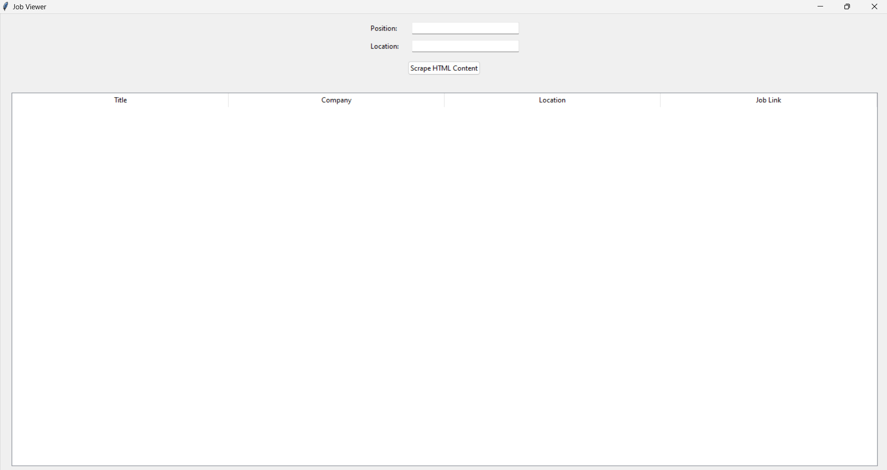

# Indeed Job Search App

Job Viewer is a Python-based desktop application that scrapes job listings from Indeed based on a given position and location, and displays the results in a user-friendly interface. This application uses Tkinter for the GUI, Selenium for web scraping, and BeautifulSoup for parsing the HTML content.

## Features

- Input fields for job position and location.
- Scrapes job listings from Indeed.
- Displays job title, company, location, and job link in a Treeview.
- Opens job link in the default web browser when clicked.

## Screenshots

### Initial UI


### Values Entered


### Result Displayed


### Excel Generated


## Prerequisites

Before you begin, ensure you have met the following requirements:

- You have installed Python 3.6 or later.
- You have installed the required Python libraries:
  - `tkinter`
  - `selenium`
  - `beautifulsoup4`
- You have Chrome browser installed.
- You have downloaded the appropriate ChromeDriver for your version of Chrome [from here](https://sites.google.com/a/chromium.org/chromedriver/downloads).

## Installing Job Viewer

1. Clone the repository:

```bash
git clone https://github.com/darshansadashiva/Indeed_Job_Search_App.git
cd Indeed_Job_Search_App
```

2. Install the required Python packages:

```bash
pip install selenium beautifulsoup4
```

3. Ensure the ChromeDriver executable is placed in the same directory as your script or in a directory included in your system's PATH.

## Using Job Viewer

1. Run the application:

```bash
python job_viewer.py
```

2. Enter the desired job position and location in the input fields.

3. Click the "Scrape HTML Content" button to start scraping.

4. View the job listings in the displayed Treeview. Click on a job link to open it in your default web browser.

## Project Structure

```
Indeed_Job_Search_App/
│
├── job_viewer.py     # Main script for the application
├── indeed_jobs.html  # Temporary file for storing HTML content
├── jobs.csv          # Temporary file for storing scraped jobs data
├── README.md         # This readme file
└── chromedriver.exe  # ChromeDriver executable
```

## Contributing to Job Viewer

To contribute to Job Viewer, follow these steps:

1. Fork this repository.
2. Create a branch: `git checkout -b <branch_name>`.
3. Make your changes and commit them: `git commit -m '<commit_message>'`.
4. Push to the original branch: `git push origin <project_name>/<location>`.
5. Create the pull request.

Alternatively, see the GitHub documentation on [creating a pull request](https://help.github.com/articles/creating-a-pull-request/).

## Author

Darshan Sadashiva

## License

This project is licensed under the MIT License - see the [LICENSE.md](LICENSE.md) file for details.

## Acknowledgements

- This project uses the Selenium and BeautifulSoup libraries for web scraping.
- Tkinter is used for building the graphical user interface.
- Thanks to Indeed for providing job listing data.
```

In this example, replace `initial_ui.png`, `values_entered.png`, `result_displayed.png`, and `excel_generated.png` with the actual filenames of your images, and make sure they are located in the `images` folder within your repository. If your images are located elsewhere, update the paths accordingly.
